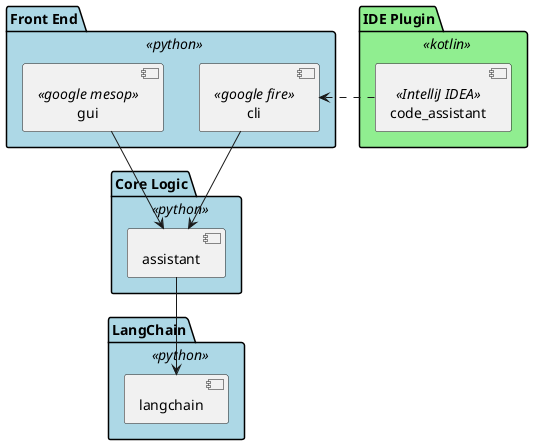
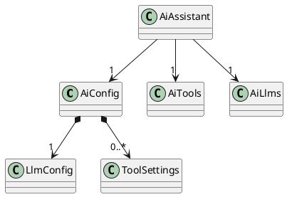

# AI Code Assistant Software Design

## Overview

```plantuml
@startuml
skinparam package {
    backgroundColor<<python>> LightBlue
    backgroundColor<<kotlin>> LightGreen
}
package "IDE Plugin" <<kotlin>> {
    [code_assistant] <<IntelliJ IDEA>>
}

package "Front End" <<python>> {
    [cli] <<google fire>>
    [gui] <<google mesop>>
}

package "Core Logic" <<python>> {
    [assistant]
}

package "LangChain" <<python>> {
    [langchain]
}

[gui] -d-> [assistant]
[cli] -d-> [assistant]
[code_assistant] .l.-> [cli]
[assistant] -d-> [langchain]
@enduml
```

## Core Logic

```plantuml
@startuml
class AiConfig {
    
}

class LlmConfig {

}

class ToolSettings {

}
class AiAssistant {

}

class AiTools {

}

class AiLlms {

}

AiAssistant -d-> "1" AiConfig
AiAssistant -d-> "1" AiTools
AiAssistant -d-> "1" AiLlms
AiConfig *-d-> "1" LlmConfig
AiConfig *-d-> "0..*" ToolSettings

@enduml
```